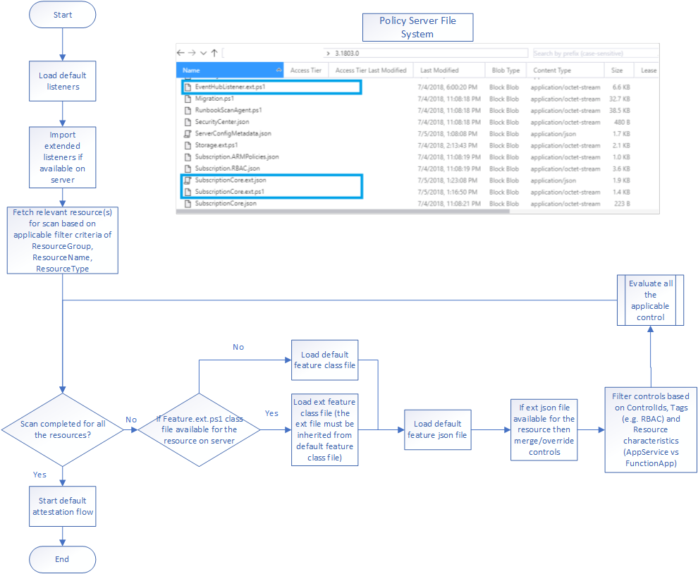
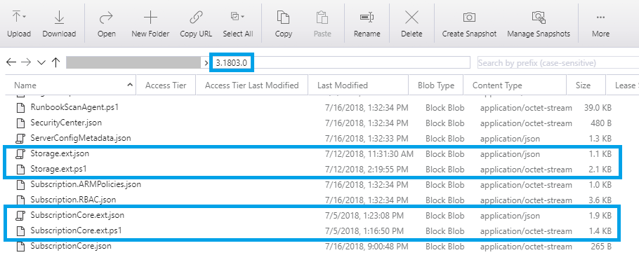

# Extending AzSK Modules

## Contents
- [Structure](README.md#overview)  
- [Know more about SVTs](README.md#setting-up-secure-devops-kit-for-azure)
- [Block diagram to represent extension model](README.md#getting-started-with-secure-devops-kit-for-azure)
- [Steps to extend the control SVT](README.md#complete-feature-set-of-secure-devops-kit-for-azure)  
- [Steps to override the logic of existing SVT](README.md#what-do-you-want-to-use-the-secure-devops-kit-for)  
- [Steps to add ext control in baseline control list](README.md#what-do-you-want-to-use-the-secure-devops-kit-for)  
- [Steps to debuge the ext control while developement](README.md#what-do-you-want-to-use-the-secure-devops-kit-for)  
- [FAQ](README.md#what-do-you-want-to-use-the-secure-devops-kit-for)  
- [References](README.md#references) 

----------------------------------------------
### Structure

Before we get started with extending the toolkit, it is important to understand the structure of the PowerShell module. Below represents the tree structure of DevOpsKit PS module, out of which you can currently extend SVT (subscription & services) and Listeners only. SVT stands for Security Verification Tests, which constitute different Azure security controls that are scanned by the DevOps Kit. Listeners are like subscribers for control evaluation results. You can route the control results data to data source choice of yours. 
		
    
      
      ├───AlertMonitoring  
      ├───ARMChecker  
      ├───ARMCheckerLib  
      ├───AzSKInfo  
      ├───ContinuousAssurance  
      ├───Framework  
      │   ├───Abstracts  
      │   │   └───FixControl  
      │   ├───Configurations  
      │   │   ├───AlertMonitoring  
      │   │   ├───ARMChecker  
      │   │   ├───AutoUpdate
      │   │   ├───AzSKInfo
      │   │   ├───ContinuousAssurance
      │   │   ├───Migration
      │   │   ├───PolicySetup  
      │   │   ├───SubscriptionSecurity  
      │   │   └───SVT  
      │   │       ├───AzSKCfg  
      │   │       ├───Services  
      │   │       └───SubscriptionCore  
      │   ├───Core  
      │   │   ├───ARMChecker  
      │   │   ├───AzSKInfo  
      │   │   ├───AzureMonitoring  
      │   │   ├───ContinuousAssurance  
      │   │   ├───FixControl  
      │   │   │   └───Services  
      │   │   ├───PolicySetup  
      │   │   ├───SubscriptionSecurity  
      │   │   └───SVT  
      │   │       ├───AzSKCfg  
      │   │       ├───Services  
      │   │       └───SubscriptionCore  
      │   ├───Helpers  
      │   ├───Listeners  
      │   │   ├───CA  
      │   │   ├───EventHub  
      │   │   ├───FixControl  
      │   │   │   └───FixControlScripts
      │   │   ├───GenericListener
      │   │   ├───OMS  
      │   │   ├───RemoteReports  
      │   │   ├───UserReports  
      │   │   └───Webhook  
      │   ├───Managers  
      │   └───Models
      │       ├───Common
      │       ├───ContinuousAssurance  
      │       ├───Exception  
      │       ├───FixControl  
      │       ├───RemoteReports  
      │       ├───SubscriptionCore  
      │       ├───SubscriptionSecurity  
      │       └───SVT  
      ├───PolicySetup  
      ├───SubscriptionSecurity  
      └───SVT  


### Know more about SVTs:


All our SVTs inherit from a base class called SVTBase which will take care of all the required plumbing from the control evaluation code. Every SVT will have a corresponding feature json file under the configurations folder. For example, Storage.ps1 (in the core folder) has a corresponding Storage.json file under configurations folder. These SVTs json have a bunch of configuration parameters, that can be controlled by a policy owner, for instance, you can change the recommendation, modify the description of the control suiting your org, change the severity, etc.

Below is the typical schema for each control inside the feature json
  ```
{
    "ControlID": "Azure_Subscription_AuthZ_Limit_Admin_Owner_Count",   //Human friendly control Id. The format used is Azure_<FeatureName>_<Category>_<ControlName>
    "Description": "Minimize the number of admins/owners",  //Description for the control, which is rendered in all the reports it generates (CSV, AI telemetry, emails etc.).
    "Id": "SubscriptionCore1100",   //This is internal ID and should be unique. Since the ControlID can be modified, this internal ID ensures that we have a unique link to all the control results evaluation.
    "ControlSeverity": "Medium", //Represents the severity of the Control. 
    "Automated": "Yes",   //Indicates whether the given control is Manual/Automated.
    "MethodName": "CheckSubscriptionAdminCount",  // Represents the Control method that is responsible to evaluate this control. It should be present inside the feature SVT associated with this control.
    "Recommendation": "There are 2 steps involved. You need to clean up (1) unexpected 'Classic Administrators'and (2) unexpected 'Owners' on the subscription. (1) Steps to clean up classic administrators (a) Go to https://manage.windowsazure.com/ --> settings tab -> administrators --> select and remove unwanted administrators using remove icon on the bottom ribbon (2) To remove unwanted members from the Owners group simply run the command 'Remove-AzureRmRoleAssignment -SignInName '{signInName}' -Scope '/subscriptions/{subscriptionid}' -RoleDefinitionName Owner'.",	  //Recommendation typically provides the precise instructions on how to fix this control.
    "Tags": [
        "SDL",
        "Best Practice",
        "Automated",
        "AuthZ"
    ], // You can decorate your control with different set of tags, that can be used as filters in scan commands.
    "Enabled": true ,  //Defines whether the control is enabled or not.
    "Rationale": "Each additional person in the Owner/Contributor role increases the attack surface for the entire subscription. The number of members in these roles should be kept to as low as possible." //Provides the intent of this control.
}
 ```  
    
After schema of the control json, let us look at the corresponding feature SVT PS1.

```PowerShell
#using namespace Microsoft.Azure.Commands.Search.Models
Set-StrictMode -Version Latest
class SubscriptionCore: SVTBase
{
	hidden [AzureSecurityCenter] $ASCSettings
	hidden [ManagementCertificate[]] $ManagementCertificates
	.
	.
	.
	hidden [string[]] $SubscriptionMandatoryTags = @()

	SubscriptionCore([string] $subscriptionId):
        Base($subscriptionId)
    {
		$this.GetResourceObject();		
    }
	.
	.
	.
	hidden [ControlResult] CheckSubscriptionAdminCount([ControlResult] $controlResult)
	{

		#Step 1: This is where the code logic is placed
		#Step 2: ControlResult input to this function, which needs to be updated with the verification Result (Passed/Failed/Verify/Manual/Error) based on the control logic
		Messages that you add to ControlResult variable will be displayed in the detailed log automatically.
		#Step 3: You can directly access the properties from ControlSettings.json e.g. $this.ControlSettings.NoOfApprovedAdmins. Any property that you add to controlsettings.json will be accessible from your SVT
		
		
		
		$controlResult.AddMessage("There are a total of $($SubAdmins.Count) admin/owner accounts in your subscription`r`nOf these, the following $($ClientSubAdmins.Count) admin/owner accounts are not from a central team.", ($ClientSubAdmins | Select-Object DisplayName,SignInName,ObjectType, ObjectId));

		if(($ApprovedSubAdmins | Measure-Object).Count -gt 0)
		{
			$controlResult.AddMessage("The following $($ApprovedSubAdmins.Count) admin/owner (approved) accounts are from a central team:`r`n", ($ApprovedSubAdmins | Select-Object DisplayName, SignInName, ObjectType, ObjectId));
		}
		$controlResult.AddMessage("Note: Approved central team accounts don't count against your limit");

		if($ClientSubAdmins.Count -gt $this.ControlSettings.NoOfApprovedAdmins)
		{
			$controlResult.VerificationResult = [VerificationResult]::Failed
			$controlResult.AddMessage("Number of admins/owners configured at subscription scope are more than the approved limit: $($this.ControlSettings.NoOfApprovedAdmins). Total: " + $ClientSubAdmins.Count);
		}
		else {
			$controlResult.AddMessage([VerificationResult]::Passed,
										"Number of admins/owners configured at subscription scope are with in approved limit: $($this.ControlSettings.NoOfApprovedAdmins). Total: " + $ClientSubAdmins.Count);
		}

		return $controlResult;
	}
	.
	.
	.
}
```

### Block diagram to represent extension model:


	
### Steps to extend the control SVT:

1. 	 Copy the SVT ps1 script that you want to extend and rename the file by replacing ".ps1" with ".ext.ps1".
	For example, if you want to extend SubscriptionCore.ps1, copy the file and rename it to SubscriptionCore.ext.ps1.
  
2. 	 You need to rename the class, inherit from the core feature class, and then update the constructor to reflect the new name as shown below:
    
   > e.g. class SubscriptionCore : SVTBase => SubscriptionCoreExt : SubscriptionCore
	
   ```PowerShell
	Set-StrictMode -Version Latest
	class SubscriptionCoreExt: SubscriptionCore
	{
	  SubscriptionCoreExt([string] $subscriptionId): Base($subscriptionId)
	  {       
	    
	  }
	}
   ```
   All the other functions from the class file should be removed.
  
3. 	 If you are modifying the logic for a specific control, then retain the required function; or if you are adding a new control, copy any control function from the base class to the extension class reference.
	> Note: For a given control in json, the corresponding PowerShell function is provided as value under MethodName property. You can search for that method under the PS script. For eg. In the below case let us assume you want to add a new control that fails if you have more than 2 co-admins. 
  
  ```PowerShell
	Set-StrictMode -Version Latest
	class SubscriptionCoreExt: SubscriptionCore
	{
		SubscriptionCoreExt([string] $subscriptionId):
		Base($subscriptionId)
		{       
		    
		}
		hidden [ControlResult] CheckSubscriptionAdminCountExtension([ControlResult] $controlResult)
		{
			#This is internal
			$scope = $this.SubscriptionContext.Scope;
			$RoleAssignments = Get-AzureRmRoleAssignment -Scope $scope -IncludeClassicAdministrators
			#Excessive number of admins (> 2)
			$SubAdmins = @();
			$SubAdmins += $RoleAssignments | Where-Object { ($_.RoleDefinitionName -eq 'CoAdministrator' -or $_.RoleDefinitionName -like '*ServiceAdministrator*') -and $_.Scope -eq $scope}
			if(($SubAdmins| Measure-Object).Count -gt 2)
			{
				$controlResult.VerificationResult = [VerificationResult]::Failed
				$controlResult.AddMessage("Number of admins/owners configured at subscription scope are more than the approved limit: 2. Total: " + $SubAdmins.Count);
			}
			else {
				$controlResult.AddMessage([VerificationResult]::Passed,
				"Number of admins/owners configured at subscription scope are with in approved limit: 2. Total: " + $SubAdmins.Count);
			}
			return $controlResult;
		}
	}
  ```  
  
  4. 	Now you need to prepare the json for the above new control. You can get started by copying the default base json, rename it to <feature>.ext.json. In this case you need to rename it as SubscriptionCore.ext.json. Remove all the other controls except for one and update it with new control details. See additional instructions as '//comments' on each line in the example JSON below. Note: Remove the comments from JSON if you happen to use the below as-is.
	
  > IMPT: Do *not* tag 'Ext' to the 'FeatureName' here. Make sure you have updated the MethodName to the new method name. 
  > Note: Remove the comments in the below JSON before saving the file
  
```
	{
	   "FeatureName": "SubscriptionCore",
	   "Reference": "aka.ms/azsktcp/sshealth",
	   "IsMaintenanceMode": false,
	   "Controls": [
            {
                "ControlID": "Azure_Subscription_AuthZ_Limit_Admin_Count_Ext",  //define the new control id
                "Description": "Minimize the number of admins", //Description for your control
                "Id": "SubscriptionCore1100", //Ensure that all the internal ids are appended with 4 digit integer code
                "ControlSeverity": "Medium", //Control the severity
                "Automated": "Yes",  // Control the automation status
                "MethodName": "CheckSubscriptionAdminCountExtension", //Update the method name with the new one provided above
                "Recommendation": "There are 2 steps involved. You need to clean up unexpected 'Classic Administrators'. Steps to clean up classic administrators: Go to https://manage.windowsazure.com/ --> settings tab -> administrators --> select and remove unwanted administrators using remove icon on the bottom ribbon.",
                "Tags": [
                      "SDL",
                      "Best Practice",
                      "Automated",
                      "AuthZ"
                ],
                "Enabled": true,
                "Rationale": "Each additional person in the Owner/Contributor role increases the attack surface for the entire subscription. The number of members in these roles should be kept to as low as possible."
            }
	   ]
	}
```
5. 	 Now upload these files to your policy storage container under base schema version folder (currently 3.1803.0) like any other org policy and add an entry to ServerConfigMetadata.json as shown below:
``` 
    {
      "Name":  "SubscriptionCore.ext.json"
    },
    {
      "Name":  "SubscriptionCore.ext.ps1"
    }
```  
   Refer the below screenshot.  
   
  
6. 	 That's it!! You can now scan the new extended control like any other control.
  
```PowerShell
	Get-AzSKSubscriptionSecurityStatus -SubscriptionId '<sid>' -ControlIds 'Azure_Subscription_AuthZ_Limit_Admin_Owner_Count_Ext'
```

### Steps to override the logic of existing SVT:

1. Add new Feature.ext.ps1/SubscriptionCore.ext.ps1 file with the new function that needs to be executed as per the above documentation.
2. Customize Feature.json file as per https://github.com/azsk/DevOpsKit-docs/blob/master/07-Customizing-AzSK-for-your-Org/Readme.md#d-customizing-specific-controls-for-a-service by overriding "MethodName" property value with the new function name that needs to be executed.
3. That's it!! You can now scan the older control with overridden functionality. 

### Steps to add ext control in baseline control list:

1. Add new control to Feature.ext.json/SubscriptionCore.ext.json file as per the above documentation.
2. Add the new ControlId in baseline control list as per https://github.com/azsk/DevOpsKit-docs/blob/master/07-Customizing-AzSK-for-your-Org/Readme.md#c-creating-a-custom-control-baseline-for-your-org
3. That's it!! The newly added control will be scanned while passing "-UseBaselineControls" switch to GSS/GRS cmdlets.

### Steps to debug the ext control while development:

Extended Feature.ext.ps1 files are downloaded at C:\Users\<UserAccount>\AppData\Local\Microsoft\AzSK\Extensions folder in the execution machine. While debugging, breakpoints need be inserted in those files. 

### FAQs:

#### I have added ext control in Storage/AppService/VirtualMachine feature as per documentation. My control is still not getting executed. The control is not even coming as Manual in the csv.
Controls in the services like Storage/AppService/VirtualMachine must have some required "Tags" in the feature.ext.json. While initialization of the feature, calculation of applicable control should be done based on those Tags. If the tags are not present in the control, it will be filtered out and will not be executed. Below are some examples of the Tags which are required for the specific features.  
      **Storage**: Either "StandardSku" or "PremiumSku"/ or both should be added based on application of the ext control  
      **AppService**:  Either "AppService" or "FunctionApp" / or both should be added based on application of the ext control  
      **VirtualMachine**: Either "Windows" or "Linux" / or both should be added based on application of the ext control  
      **SQLDatabase**: "SqlDatabase" should be added if control is applicable for SQLDatabase.   
      For more details about Tag please refer: [Tag details](https://github.com/azsk/DevOpsKit-docs/blob/master/01-Subscription-Security/Readme.md#target-specific-controls-during-a-subscription-health-scan) 
    
### References:
- [SubscriptionCore.ext.json](SubscriptionCore.ext.json)
- [SubscriptionCore.ext.ps1](SubscriptionCore.ext.ps1)
- [Feature.ext.json](Feature.ext.json)
- [Feature.ext.ps1](Feature.ext.ps1)
- [ListenerName.ext.ps1](ListenerName.ext.ps1)
