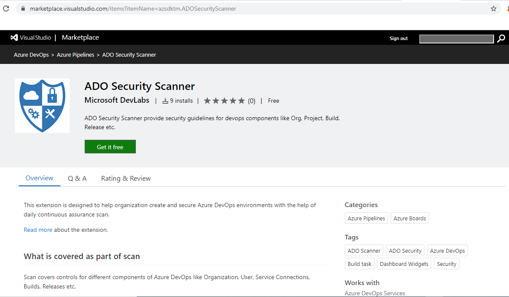
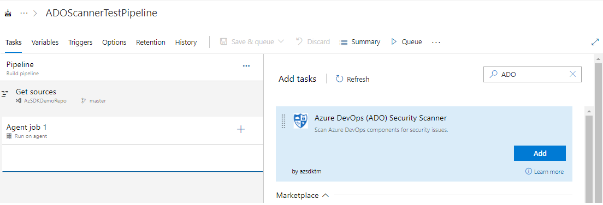
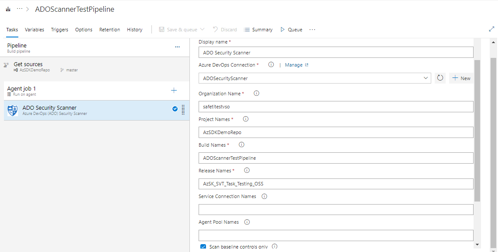
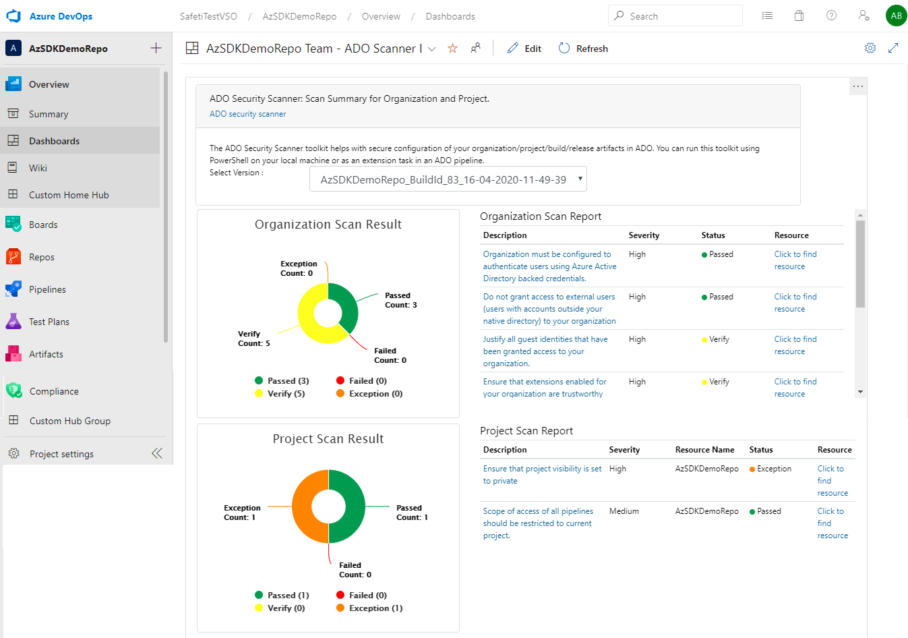

> The Secure DevOps Kit for Azure (AzSK) was created by the Core Services Engineering & Operations (CSEO) division at Microsoft, to help accelerate Microsoft IT's adoption of Azure. We have shared AzSK and its documentation with the community to provide guidance for rapidly scanning, deploying and operationalizing cloud resources, across the different stages of DevOps, while maintaining controls on security and governance.
<br>AzSK is not an official Microsoft product – rather an attempt to share Microsoft CSEO's best practices with the community..
# Secure Azure DevOps (VSTS) -Preview

### [Overview](Readme.md#Overview)
 - [Installation Guide](Readme.md#Installation-Guide)

### [Scan your Azure DevOps resources](Readme.md#setting-up-org-policy)
 
### [Continuous Assurance](Readme.md#setting-up-org-policy)
  - [Setting up Continuous Assurance - Step by Step]()
  - [Visualize security scan results]()


 


AzSK for Azure DevOps performs security scanning for core areas of Azure DevOps/VSTS like Organization, Projects, Users, Connections, Pipelines (Build & Release). 


## Installation Guide

>**Pre-requisites**:
> - PowerShell 5.0 or higher. 

1. First verify that prerequisites are already installed:  
    Ensure that you have PowerShell version 5.0 or higher by typing **$PSVersionTable** in the PowerShell ISE console window and looking at the PSVersion in the output as shown below.) 
 If the PSVersion is older than 5.0, update PowerShell from [here](https://www.microsoft.com/en-us/download/details.aspx?id=54616).  
      

2. Install the Secure DevOps Kit for Azure DevOps (AzSK.AzureDevOps) PS module:  
	  
```PowerShell
  Install-Module AzSK.AzureDevOps -Scope CurrentUser
```

Note: 

You may need to use `-AllowClobber` and `-Force` options with the Install-Module command 
above if you have a different version of same modules installed on your machine.


## Scan your Azure DevOps resources

Run the command below after replacing `<OrganizationName>` with your Azure DevOps Org Name 
and `<PRJ1, PRJ2, ..`> with a comma-separated list of project names where your Azure DevOps resources are hosted.
You will get Organization name from vsts url e.g. http://samplevstsorg.visualstudio.com. In this 'samplevstsorg' is Org name.

```PowerShell
Get-AzSKAzureDevOpsSecurityStatus -OrganizationName "<OrganizationName>" -ProjectNames "<PRJ1, PRJ2,...etc.>"
```

Command also supports other parameters of filtering resources.
For instance, you can also make use of the 'BuildNames','ReleaseNames' to filter specific resource

```PowerShell

#Scan Organization
Get-AzSKAzureDevOpsSecurityStatus -OrganizationName "<OrganizationName>"

#San Organization and Project
Get-AzSKAzureDevOpsSecurityStatus -OrganizationName "<OrganizationName>" -ProjectNames "<PRJ1,PRJ2,etc>" 

#Scan Org, project and Builds
Get-AzSKAzureDevOpsSecurityStatus -OrganizationName "<OrganizationName>" -ProjectNames "PRJ1" -BuildNames "<BLD1, BLD2,...etc.>" 

#Scan Org, project and releases
Get-AzSKAzureDevOpsSecurityStatus -OrganizationName "<OrganizationName>" -ProjectNames "PRJ1" -ReleaseNames "<RLS1, RLS2,...etc.>" 

#Scan Org, project, all builds and releases
Get-AzSKAzureDevOpsSecurityStatus -OrganizationName "<OrganizationName>" -ProjectNames "PRJ1" -BuildNames "*" -ReleaseNames "*" 

#Scan all supported artifacts
Get-AzSKAzureDevOpsSecurityStatus -OrganizationName "<OrganizationName>" -ScanAllArtifacts
```


Similar to Azure AzSK SVT scan, outcome of the analysis is printed on the console during SVT execution and a CSV and LOG files are 
also generated for subsequent use.

The CSV file and LOG file are generated under a Org-specific sub-folder in the folder  
*%LOCALAPPDATA%\Microsoft\AzSK.AzureDevOpsLogs\Org_[yourOrganizationName]*  
E.g.  
C:\Users\UserName\AppData\Local\Microsoft\Azure.DevOpsLogs\Org_[yourOrganizationName]\20181218_103136_GADS

Refer [doc](../02-Secure-Development#understand-the-scan-reports) for understanding the scan report and [link](./ControlCoverage) for current control coverage for Azure DevOps


## Continuous Assurance

The basic idea behind Continuous Assurance (CA) is to setup periodic security scan and if new, more secure options become available for a feature, it should be possible to detect that an application or solution can benefit from them and notify/alert the owners concerned.

Scan is performed via security scanner task in the pipeline and results can be visualized via dashboard by adding ADO security scanner widgets into the Azure DevOps project’s dashboard. Pipeline can be setup with the trigger to run periodically and provide continuous assurance.

### Setting up Continuous Assurance - Step by Step

In this section, we will walk through the steps of setting up a DevOps pipeline for ADO Continuous Assurance coverage.
To get started, we need the following 

__Prerequisite:__

- DevOps organization and project 
- "Project Collection Administrator" or "Owner" permission to perform below task:

    •	Install "ADO Security Scanner" extension

    •	Setup pipeline with scanner task.
    
    •	Create dashboard to visualize scan results


#### Install “ADO Security Scanner” extension for your Azure DevOps Organization


Extension has been published to the visual studio marketplace gallery under “Azure DevOps > Azure Pipeline” category. You can now install this extension from the Marketplace directly (https://marketplace.visualstudio.com/items?itemName=azsdktm.ADOSecurityScanner).

Refer doc [here](https://docs.microsoft.com/en-us/azure/devops/marketplace/install-extension?view=azure-devops&tabs=browser) for more about installing extensions for org

   


#### Adding ADO Security Scanner in the pipeline

This part assumes that you are familiar with Azure DevOps build tasks and pipelines at a basic level. Our goal is to show how ADO Security Scanner can be added into the build/release workflow.

__Step-1__: Create a build pipeline or open an existing one.

__Step-2__: Add “ADO Security Scanner” task to the pipeline

Click on "Add Tasks" and select "Azure DevOps (ADO) Security Verification".



__Step-3__: Specify the input parameters for the task.
The "ADO Security Scanner" task starts showing in the "Run on Agent" list and displays some configuration inputs that are required for the task to run. These are none other than the familiar options we have been specifying while running the ADO scan manually - you can choose to specify the target Org, projects, builds and releases based on how your Org resources are organized.



> **Note:** This task also requires Azure DevOps connection containing Org details and PAT token to scan the required resources. Refer doc [here](https://docs.microsoft.com/en-us/azure/devops/organizations/accounts/use-personal-access-tokens-to-authenticate?view=azure-devops&tabs=preview-page) to create token and provide it as part of connection


__! important__ : Make sure you **DO NOT** select  checkbox for "Grant access permission to all pipelines" before saving service connection. 

__Step-4__: Click “Save & queue”


Task will install latest AzureDevOps scanner module and start scanning based on input parameters. 


At the end, it will show the summery of scan and store the result in extension storage


__Step-4__: Setup scheduled trigger for pipeline

Once you are able to successfully run the ADO scan using ADO pipeline, you can configure scheduled trigger to get latest visibility of security on resources


### Visualize security scan results 

Once scan is completed as part of pipeline, results can be visualized with the help of project dashboard.

Extension mainly provides two widgets that can be added as part of dashboard

__•	Org Level Security Scan Summary__: Displays Org level security control evaluation summary. This dashboard helps Org owners to take action based on control failures.

__•	Project Components Security Scan Summary__: Displays project components (Build/Release/Connections) security control evaluation summary.

__Steps__:

1. Go to project dashboard under your organization and create new dashboard for Org level summary

    

2. Click edit or add widget > Search for “__Org Level Security Scan Summary__” > Click ‘Add’ followed by “Done Editing”

    

3. Dashboard will start displaying scanned results 

    

Step 1,2 & 3 needs to be repeated to add “__Project Component Security Scan Summary__”


> **Note:**  Dashboard created will be visible to all users which are part of project.


