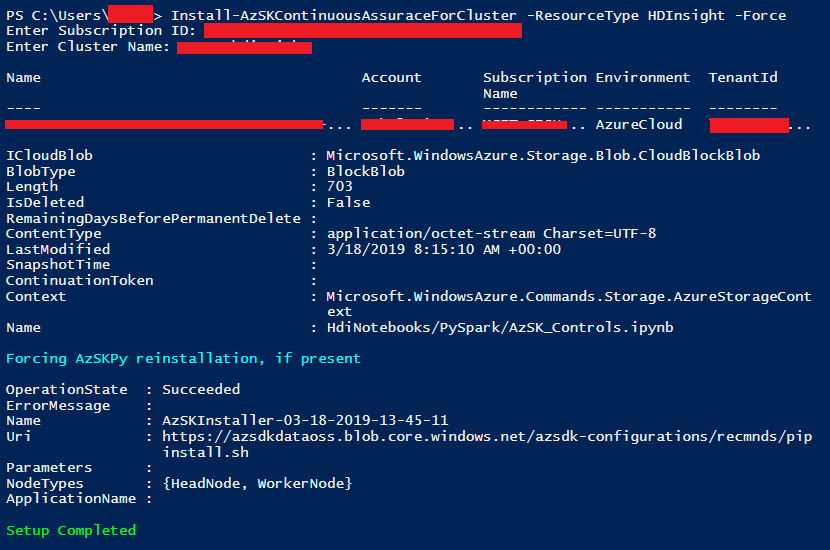
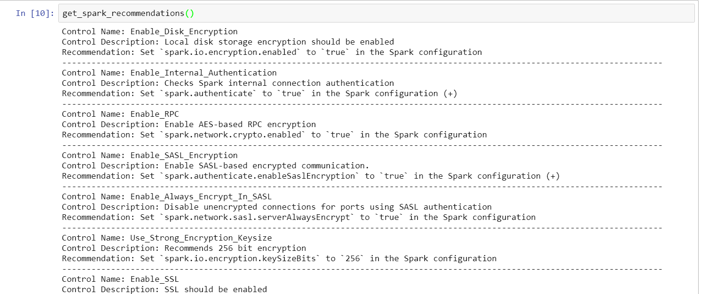
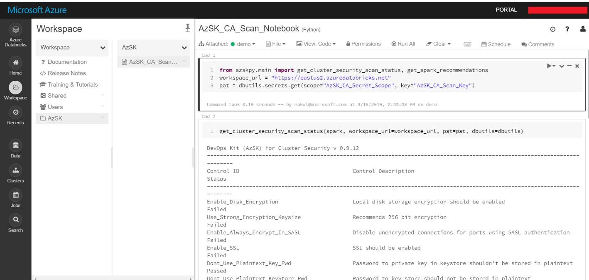
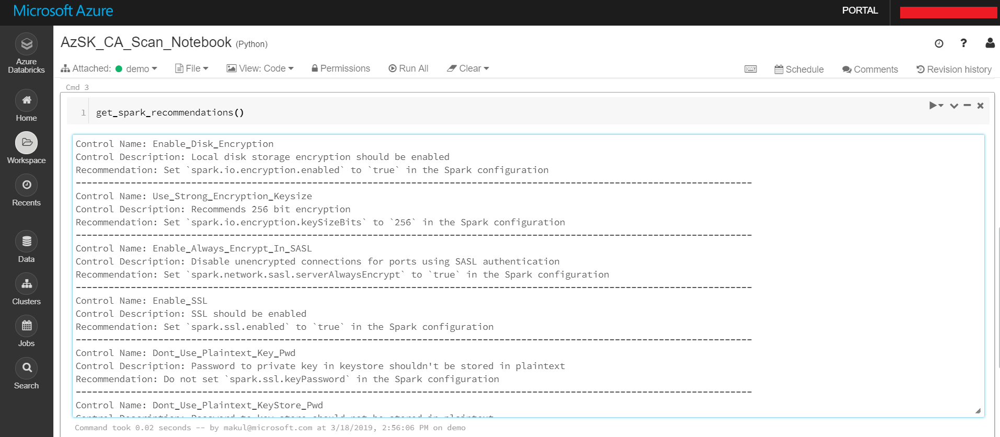
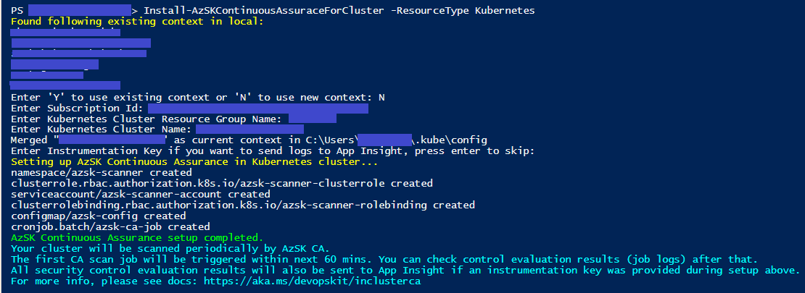

# AzSK Continuous Assurance for Cluster Installation Steps

### Contents
- [Downloading Script](Readme.md#downloading-script)
- [Prerequisites](Readme.md#prerequisites)
- [Setting up HDInsight](Readme.md#Setting-up-HDInsight)
- [Setting up Azure Databricks](Readme.md#Setting-up-Azure-Databricks)
- [Setting up AKS](Readme.md#Setting-up-AKS)
-----------------------------------------------------------------
## Downloading Script
1.	Please download the PowerShell script from https://azsdkdataoss.blob.core.windows.net/azsdk-configurations/recmnds/Install-CAForCluster.ps1.
2.	Open and run the downloaded script in PowerShell ISE.

## Prerequisites
1.	For every cluster type, we assume the required cluster is already created in your subscription. 
2.	You may need to pass additional details like cluster location (for Databricks) so note it down while creating the resource to keep it handy. 
3.	All scripts use Azure Powershell. If you don’t have it installed please visit: https://docs.microsoft.com/en-us/cli/azure/install-azure-cli-windows?view=azure-cli-latest  
4.	For Kubernetes, additionally you will need to install `kubectl`. Run the following command after installing Azure PowerShell
    ```PowerShell
    az aks install-cli
    ```

## Setting up HDInsight

1. Install Continuous Assurance for HDInsight cluster using the command:                

    

2.	On successful installation you will see the following results. You may pass the *-Force* parameter to reinstall `AzSKPy` to force reinstallation to a new version. 

    

3.	This will add a new notebook to your `PySpark` folder in the HDI Cluster.

    

4.	Open the notebook.

5.	Hit *Shift+Enter* or select *Cell -> Run* all to run all the cells and see the output.

    

6.	The next cell will display recommendations.

    

## Setting up Azure Databricks

1.	Use the following command to setup AzSK job for Databricks and input the cluster location and PAT.

    

2.  Go to your cluster settings in workspace and make sure it's running. In the Libraries tab, select intsall new. Then select library source as "PyPi". Leave the Repository blank and enter "azskpy" in the Package text field and click install. This will install the AzSKPy library in the cluster. 

3.	Head on to your Databricks Workspace to open up the notebook.

    

4.	Similarly, press *Shift+Enter* to run the cells, or *Run All* to show the output.

    

5. The next cell will show the recommendations to fix the controls.

    

## Setting up AKS

1. To install AzSK CA on Kubernetes cluster run the below command 

    ```PowerShell
    Install-AzSKContinuousAssuraceForCluster -ResourceType Kubernetes
    ```

   

   During insatallation you can choose to send you control evaluation results to App Insight. If you want to send events to App Insight, please provide instrumention key during setup.

2.	To view the logs of the last CA job, run the below command

    ```PowerShell
    $lastJobPod = kubectl get pods --namespace azsk-scanner -o jsonpath='{.items[-1:].metadata.name}' 
    Kubectl logs $lastJobPod --namespace azsk-scanner
    ```
    

3.	To view details like CA job schedule, last schedule run the below command


    ```PowerShell
    kubectl get cronjob azsk-ca-job --namespace azsk-scanner
    ```
    

4. To view logs of any specific job

    a. List all the pods created by AzSK CA job using below command

    ```PowerShell
        kubectl get cronjob azsk-ca-job --namespace azsk-scanner
     ```

    

    b. Pick up the pod name for which you want to see the logs, and run the below after replacing the podname

    ```PowerShell
        Kubectl logs <podname>--namespace azsk-scanner
     ```

    
