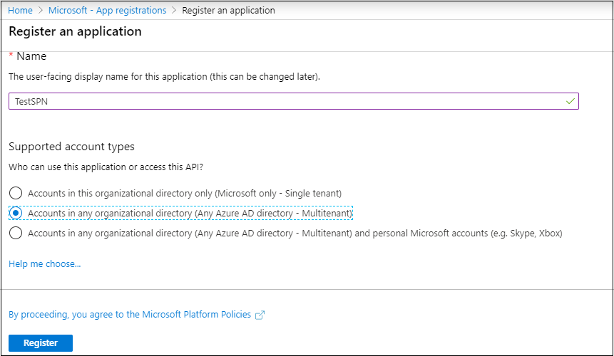
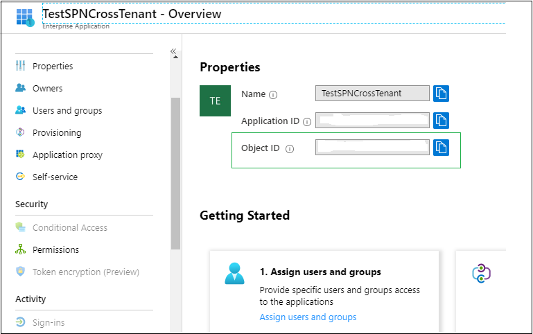

> The Secure DevOps Kit for Azure (AzSK) was created by the Core Services Engineering & Operations (CSEO) division at Microsoft, to help accelerate Microsoft IT's adoption of Azure. We have shared AzSK and its documentation with the community to provide guidance for rapidly scanning, deploying and operationalizing cloud resources, across the different stages of DevOps, while maintaining controls on security and governance. 
AzSK is not an official Microsoft product – rather an attempt to share Microsoft CSEO's best practices with the community..

# AzSK setup across multiple tenants

There are scenarios where teams have multiple Azure subscriptions spread across multiple tenants. Typically they can deploy one 'Continuous Assurance' setup per tenant (in central scan mode) and push the AzSK scan results from all of them into a single central Log Analytics workspace. 

The above solution can be simplified using the following steps, albeit with some limitations listed in the end. 

## <b>How to setup cross tenant Continuous Assurance (CA)?</b>

By now you would be aware that when you install CA in your Azure subscription, it adds a service principal runtime account as a 'reader' on that subscription. So when you want to setup CA on subscriptions that are spread across multiple tenants, it would be required that this service principal runtime account has 'reader' access on all those subscriptions.

You can achieve it by using Azure delegated resource management. 
Azure delegated resource management enables logical projection of resources from one tenant onto another tenant.

><b>NOTE:</b> This approach has certain [known limitations](README.md#known-limitations). It would be important that you go through them  before you take all the steps listed below.

### <b>Prerequisites</b>:
1. You need to have 'Owner' permissions on all the subscriptions i.e. on which you want to setup CA and the ones which you want to be scanned by CA.
2. You need to know the tenant id of the subscription where the CA automation account and other related components will be installed. We will refer this subscription as <b>'central subscription'</b> in the context of this article.
3. You need to know the subscription ids of the target subscriptions.

### <b>Steps to follow: </b>
1. Go to your central subscription.
2. Go to 'App registrations' and click on '+New registration'. 
3. Select type 'Accounts in any organizational directory (Any Azure AD directory - Multitenant)'.
   
4. Provide 'Name' and click on 'Register'.
5. Once the app registration is completed, click on 'Managed application in local directory' under 'Overview'.
6. It will open up 'Properties' blade of the enterprise application. Note the 'ObjectId' of the application. It would be required in the    further steps.
   
7. Update the [CrossTenantParams.json](./CrossTenantParams.json) with the collected prerequisites. 
8. Deploy the [delegatedResourceManagement.json](./delegatedResourceManagement.json) and [CrossTenantParams.json](./CrossTenantParams.json) to the target subscription using the commands below:

    ```PowerShell
    # Log in first with Connect-AzAccount
    Connect-AzAccount
    
    # Set context to the target subscription
    Set-AzContext -Subscription <subscriptionId of the target subscription>

    # Deploy Azure Resource Manager template using template and parameter file locally
    New-AzDeployment -Name <deploymentName> `
                    -Location <AzureRegion> `
                    -TemplateFile <local path To delegatedReourceManagement.json> `
                    -TemplateParameterFile <local path To CrossTenantParams.json> `
                    -Verbose

    ```
9. You can confirm successful onboarding of the target subscription by going to 'Service Providers' page in target subscription.
10. You need to follow this process for all the target subs that you want to onboard to CA.
11. Now you need to install CA on the central subscription in 'central scan' mode by providing target subscription id(s) and passing display name of the service principal in step #2 as the AzureADAppName. You can refer the installation steps [here](../04-Continous-Assurance/Readme.md#continuous-assurance-ca---central-scan-mode)
12. Note that CA scan logs for all the target subscriptions will be available in the storage under AzSKRG resource group of the central subscription.

## <b>Known limitations</b>
* Currently, you can’t onboard a subscription (or resource group within a subscription) for Azure delegated resource management if the subscription uses Azure Databricks. Similarly, if a subscription has been registered for onboarding with the Microsoft.ManagedServices resource provider, you won’t be able to create a Databricks workspace for that subscription at this time.

* While you can onboard subscriptions and resource groups for Azure delegated resource management which have resource locks, those locks will not prevent actions from being performed by users in the managing tenant. Deny assignments that protect system-managed resources, such as those created by Azure managed applications or Azure Blueprints (system-assigned deny assignments), do prevent users in the managing tenant from acting on those resources; however, at this time users in the customer tenant can’t create their own deny assignments (user-assigned deny assignments).


## <b>References</b>
1. [Azure delegated resource management](https://docs.microsoft.com/en-us/azure/lighthouse/concepts/azure-delegated-resource-management)
